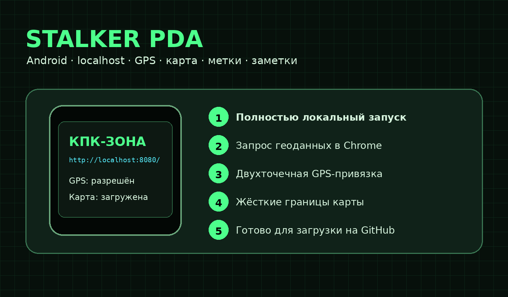
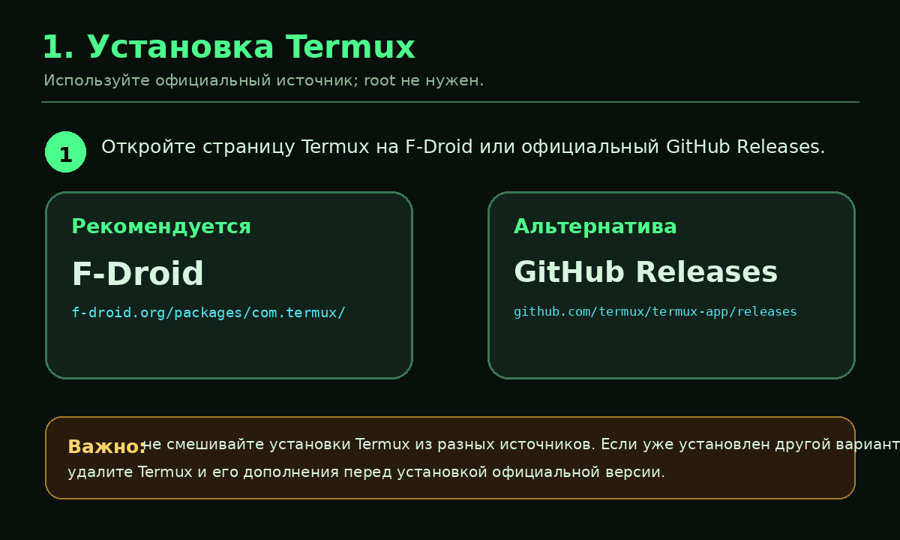
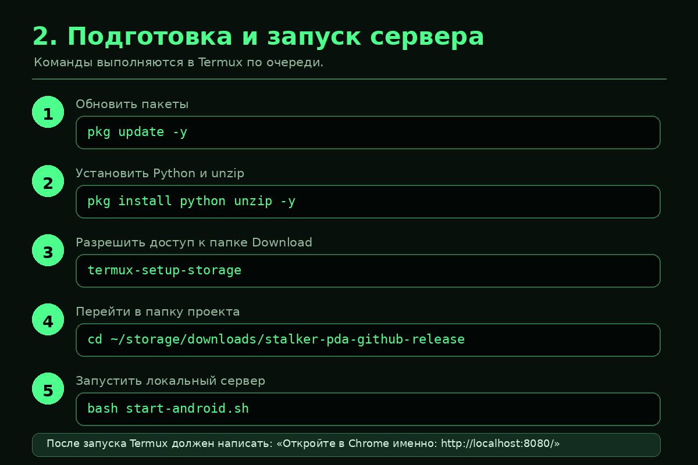
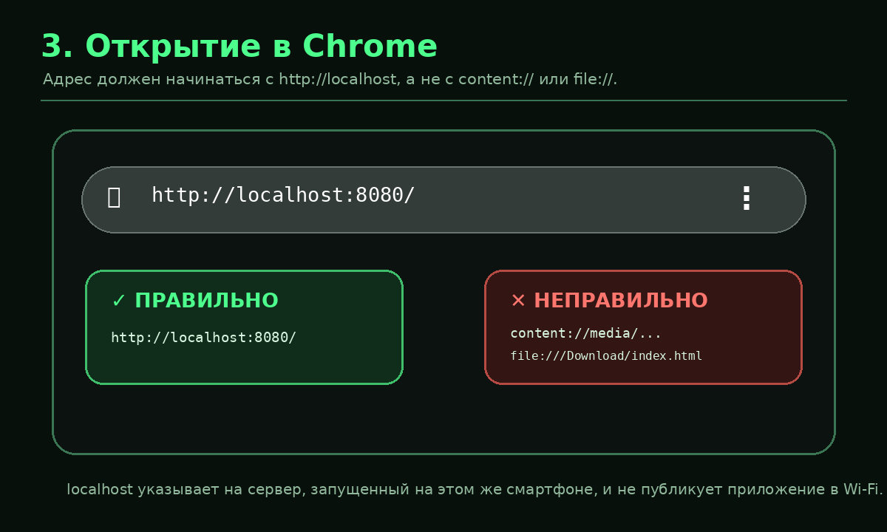
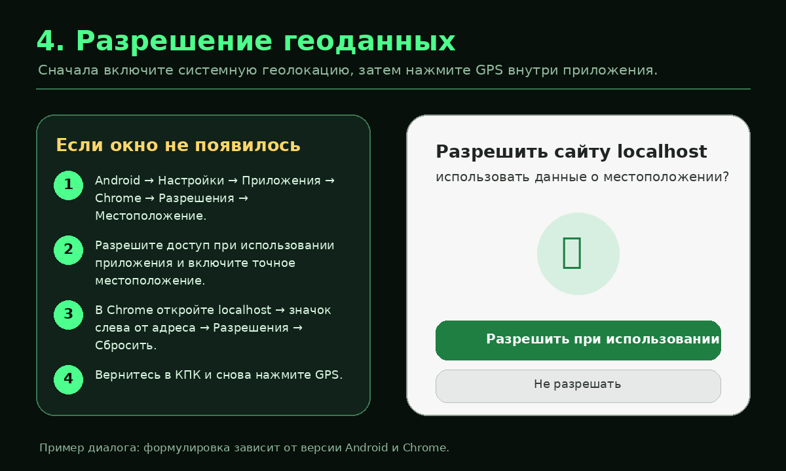
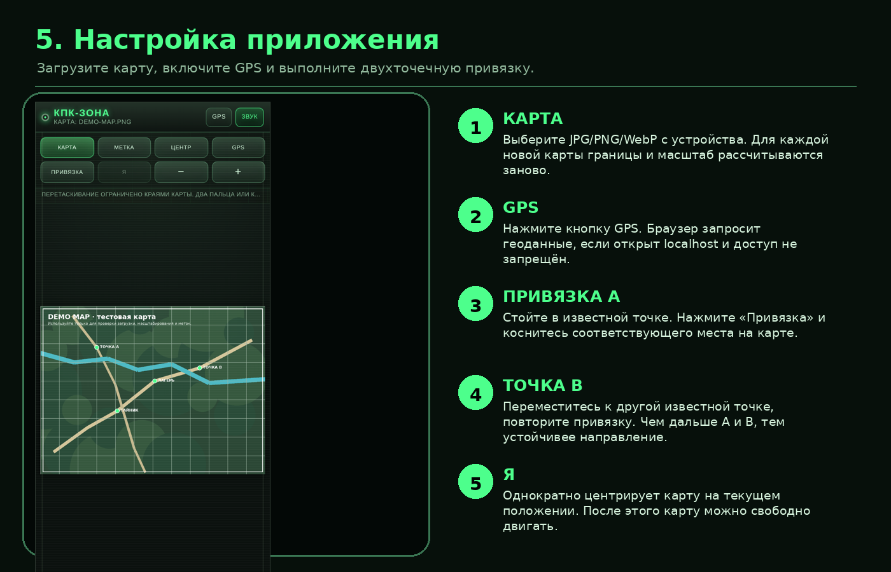
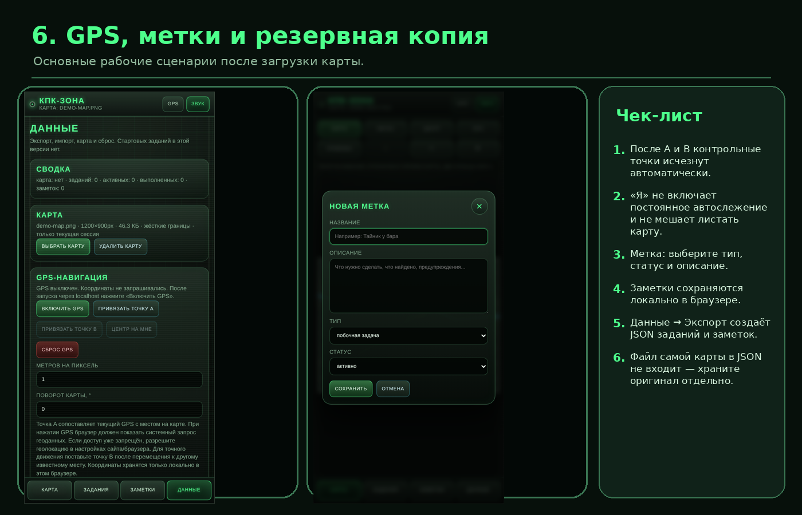

# STALKER PDA — Android GPS Release 6



Однофайловое мобильное веб-приложение в стиле КПК из S.T.A.L.K.E.R. с пользовательской картой, двухточечной GPS-привязкой, игровыми метками, заданиями, заметками и локальным хранением данных.

Приложение не требует сборки и внешних библиотек. Для корректной работы GPS на Android его рекомендуется открывать **именно через локальный адрес `http://localhost:8080/`**, а не через `content://`, `file://` или прямое открытие HTML из файлового менеджера.

## Быстрый запуск на Android

### 1. Установите Termux

Используйте официальный выпуск Termux из F-Droid или GitHub Releases. Root-доступ не нужен.



### 2. Подготовьте Termux

Выполните команды по очереди:

```bash
pkg update -y
pkg install python unzip -y
termux-setup-storage
```

На запрос Android разрешите Termux доступ к файлам. Затем распакуйте архив проекта в папку `Download` и запустите сервер:

```bash
cd ~/storage/downloads/stalker-pda-android-github-release
bash start-android.sh
```

Либо вручную:

```bash
python server.py --port 8080
```



### 3. Откройте правильный адрес

В Google Chrome введите **точно**:

```text
http://localhost:8080/
```



Не открывайте `index.html` через файловый менеджер. Адреса вида `content://media/...` и `file:///...` могут не дать браузеру запросить геоданные.

### 4. Разрешите GPS

1. Включите системную геолокацию Android.
2. Откройте КПК через `localhost`.
3. Нажмите кнопку **GPS** внутри приложения.
4. В системном окне выберите разрешение геоданных при использовании Chrome.



### 5. Настройте карту и GPS-привязку



1. Нажмите **Карта** и выберите JPG, PNG или WebP.
2. Нажмите **GPS** и дождитесь координат.
3. Встаньте в известной точке местности, нажмите **Привязка** и укажите это место на карте — точка A.
4. Переместитесь к другой известной точке и аналогично создайте точку B.
5. Нажмите **Я**, чтобы один раз центрировать карту на себе.

После привязки A/B служебные точки автоматически исчезают. Кнопка **Я** не включает постоянную автоподцентровку: после неё карту можно свободно перемещать.

## Возможности

- загрузка новой карты с устройства;
- жёсткое ограничение перемещения границами текущего изображения;
- масштабирование жестом двумя пальцами, кнопками и колесом мыши;
- двухточечная GPS-привязка;
- одноразовое центрирование по текущей позиции;
- типы меток: задача, аномалия, тайник, переход, торговец, группировка, опасность, лаборатория и заметка;
- статусы заданий;
- заметки;
- экспорт и импорт JSON;
- локальное сохранение данных в браузере;
- отсутствие стартовых заданий.



## Полная инструкция

- [Подробная установка на Android](docs/ANDROID_SETUP.md)
- [Устранение неполадок](docs/TROUBLESHOOTING.md)
- [Загрузка проекта на GitHub и GitHub Pages](docs/GITHUB_UPLOAD.md)
- [Офлайн HTML-инструкция](GUIDE_ANDROID.html)
- [Отчёт аудита Release 6](AUDIT_REPORT.txt)

## Структура проекта

```text
stalker-pda-android-github-release/
├── index.html                 # приложение
├── server.py                 # loopback-only сервер для localhost
├── start-android.sh          # быстрый запуск в Termux
├── GUIDE_ANDROID.html        # инструкция, которую можно открыть через localhost
├── README.md
├── SECURITY.md
├── CHANGELOG.md
├── AUDIT_REPORT.txt
├── VERSION
├── examples/
│   └── demo-map.png          # тестовая карта без реальных координат
└── docs/
    ├── ANDROID_SETUP.md
    ├── TROUBLESHOOTING.md
    ├── GITHUB_UPLOAD.md
    └── images/
```

## Важное о данных

- Карта выбирается отдельно с устройства.
- Экспорт JSON содержит задания, заметки и GPS-привязку, но не включает файл карты.
- Храните оригинал карты отдельно.
- Сервер по умолчанию слушает только `127.0.0.1`, поэтому к нему нельзя подключиться с другого устройства по Wi‑Fi.
- Приложение не использует внешние JS/CSS-библиотеки и не отправляет загруженную карту на сервер.

## Остановка сервера

Вернитесь в Termux и нажмите:

```text
Ctrl+C
```

В экранной клавиатуре Termux комбинация обычно выполняется кнопкой `CTRL`, затем `C`.

## Официальные справочные источники

- Termux: https://termux.dev/en/
- Termux на F-Droid: https://f-droid.org/packages/com.termux/
- Termux GitHub: https://github.com/termux/termux-app
- Geolocation API: https://developer.mozilla.org/docs/Web/API/Geolocation_API
- Secure Contexts: https://developer.mozilla.org/docs/Web/Security/Secure_Contexts
- Настройки разрешений Chrome Android: https://support.google.com/chrome/answer/114662
